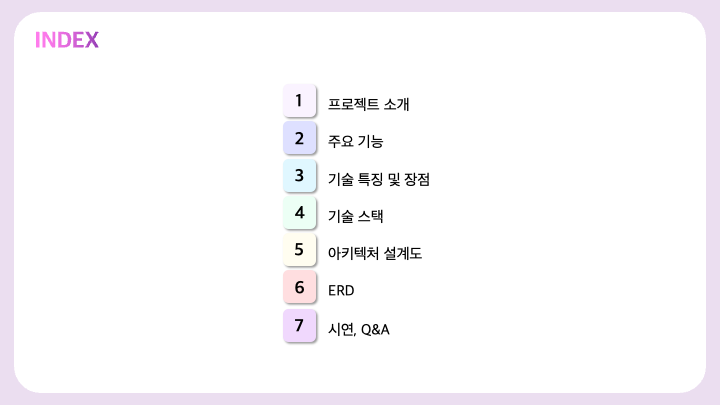
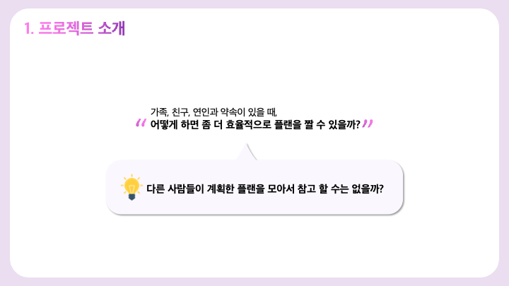
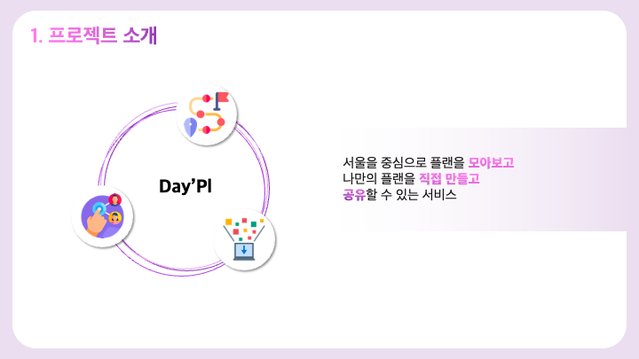
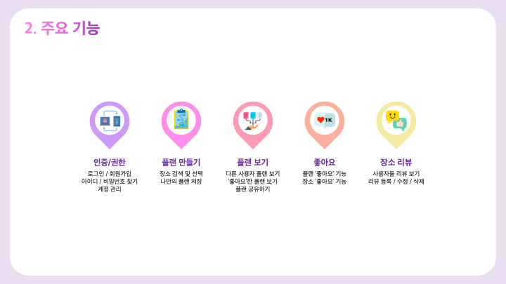
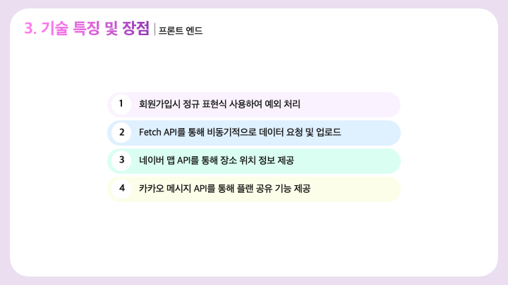
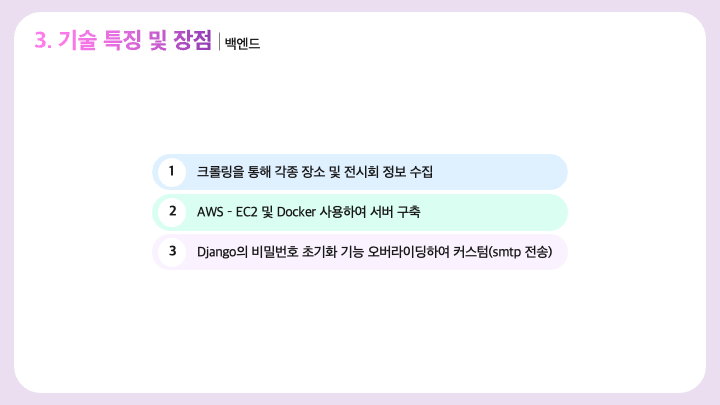
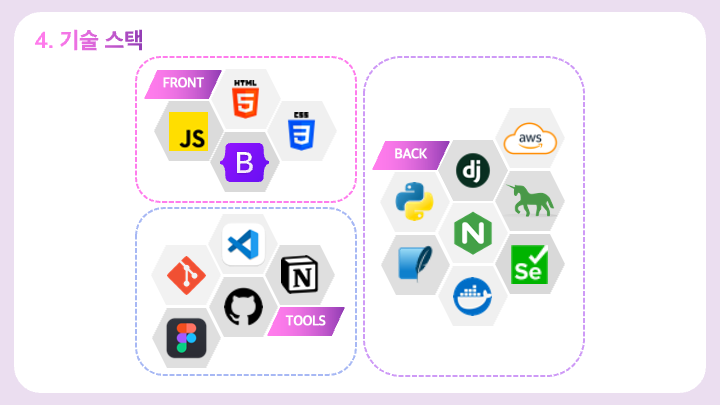
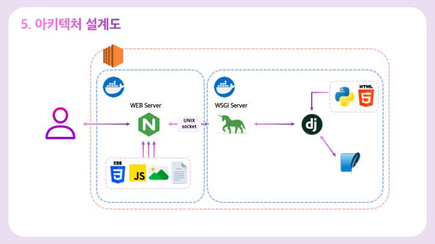
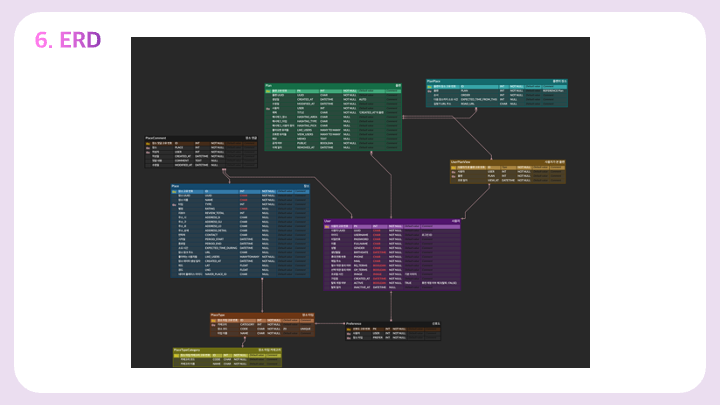

# Day_Pl

## Links

 

## 프로젝트 소개

> 서울을 중심으로 하루 플랜을 모아보고 계획하고 공유하는 서비스

## 기획 의도

🤔 가족, 친구, 연인과 약속이 있을 때 <strong>‘어떻게 하면 좀 더 효율적으로 플랜을 짤 수 있을까?</strong>라는 고민에서 시작하였습니다. 
 
💡 <strong>’다른 사람들이 계획한 플랜을 모아서 참고할수는 없을까?’</strong>라는 발상으로 
 
‼️ 서울을 중심으로 
다른 사용자들의 플랜을 **모아보고** 
나만의 플랜을 직접 **만들고** 
**공유**할 수 있는 
 
✨ <strong>데이플(Day’Pl)</strong>을 시작하였습니다.

 
 
 
 
 
 
 
 
 

## 시연 영상

<iframe width="981" height="552" src="https://www.youtube.com/embed/tTFsOt7xbrY" title="Day Pl 시연 영상" frameborder="0" allow="accelerometer; autoplay; clipboard-write; encrypted-media; gyroscope; picture-in-picture; web-share" allowfullscreen></iframe>
